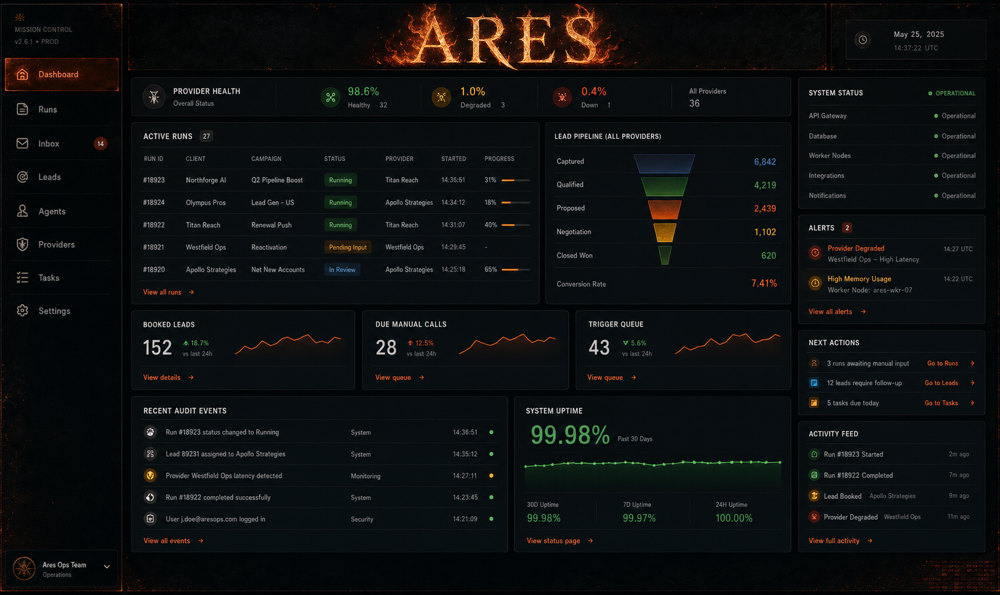

# ARES Dashboard Theme Direction

Status: concept approved for the next dashboard UI slice.

## Direction

- Keep the dashboard first: dense operations board, real Mission Control modules, readable data, and fast scanning.
- Use the mythic theme as atmosphere, not a game HUD.
- Title treatment: `ARES` only, with controlled flame treatment around the title.
- Palette: obsidian, graphite, ember orange, deep red, iron/brass accents.
- Typography: gothic-inspired display treatment only for the brand/title; normal dashboard text stays crisp and readable.
- Tech layer: restrained pixel-grid overlays, subtle scanlines, compact status LEDs, terminal-style microtext.

## Do Not Do

- Do not use protected game logos, symbols, character art, weapons, or exact franchise branding.
- Do not make the dashboard feel like a game menu.
- Do not sacrifice density or usability for decorative panels.
